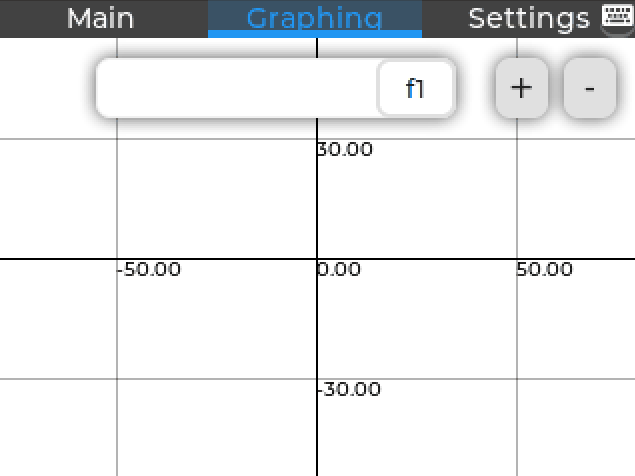

<h1 align="center"><b>Smart Graphing Calculator </b></h1>


<h2 align="center"><b>UHCL Senior Projects Group 2</b></h2>

<p align="center"> 

</p>

**Greetings!** This is the repository for our Smart Symbolic Graphing Calculator. Written in C/C++, this project utilizes [LVGL](https://github.com/lvgl/lvgl) and [Giac](https://www-fourier.ujf-grenoble.fr/~parisse/giac.html) to create a free and open source and extensible symbolic calculator that is able to used in both testing environments and general calculation applications. Websocket communication is done using the [easywsclient](https://github.com/dhbaird/easywsclient) library. JSON manipulation is made possible by the [JSON for Modern C++](https://github.com/nlohmann/json) and [json-schema-validator](https://github.com/pboettch/json-schema-validator)
 libraries.

Some of the algorithmic implementations, such as plotting and optimal tick generation, were gathered and translated from the [Julia Programming Language](https://github.com/JuliaLang/julia) into C++.

### BUILD INSTRUCTIONS
---
**The currently reccommended method of building this project is using CMake in a POSIX-compliant environment. Windows is technically supported, however, many features may not work or are broken.**

### Build flags
Current default build flags are as follows:

- -DLINUX_ENABLE=ON
- -DGIAC_ENABLE=ON
- -DPI_ENABLE=OFF
- -DWINDOWS_ENABLE=OFF

The following is a quickstart on how to clone and build this project on arch linux with proper vscode intellisense support:

```bash
sudo pacman -S base-devel giac sdl2 cmake
git clone --recursive https://github.com/GKJose/Smart_Symbolic_Graphing_Calculator.git
cd Smart_Symbolic_Graphing_Calculator
cmake -DGIAC_ENABLE=ON .
cmake --build .
```

The following command below is an example on how to clone and build this project on the raspberry pi:

```bash
sudo apt install -y build-essential libgiac-dev libmpfr-dev libgmp3-dev python3-smbus i2c-tools cmake nmap
git clone --recursive https://github.com/GKJose/Smart_Symbolic_Graphing_Calculator.git
cd Smart_Symbolic_Graphing_Calculator
cmake -DLINUX_ENABLE=OFF -DPI_ENABLE=ON -DGIAC_ENABLE=ON .
make all -j
```

The binary file named `SSGC` will appear in the `build/out` directory.

To run the binary file, simply write `./build/out/SSGC`.

### VSCODE Intellisense Support

To have proper intellisense support while developing this project, ensure that the [Cmake Tools](https://marketplace.visualstudio.com/items?itemName=ms-vscode.cmake-tools) extension is installed, and that the project is configured.

To configure the project, press `Ctrl + Shift + P`, and search for the **Cmake: Configure** option. The project _should_ correctly automatically configure itself. In the event that the log output changes, i.e. _Enabling Giac Linkage..._ no longer appeared in stdout after configuring, run `cmake -DGIAC_ENABLE=ON .` to fix any possible linkage issues.

### _Alternative Portable Build System_

If for any reason CMake is not available on your system. A portable python 3.10.2 build system is also included with the project named **cinit**.

To initialize the project run `./cinit.py init` **first** (if not done, the project will fail to build). To build the project, run `./cinit.py make -j`. The resulting binary should be present in the `build/out` directory.

_Please note that the cinit.py build system may not be updated to work with the latest version of the project. It is **highly recommended** to build this project using CMake._

The following blog post was used as a reference:
https://blog.lvgl.io/2018-01-03/linux_fb
